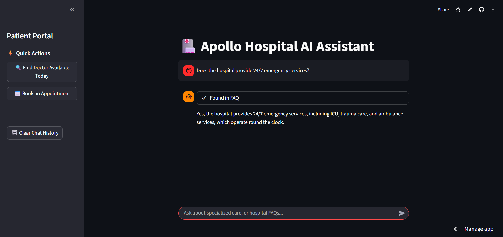
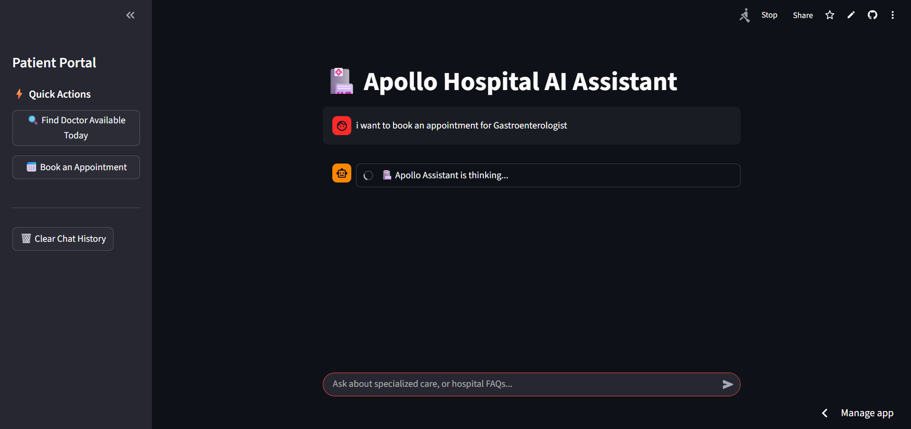
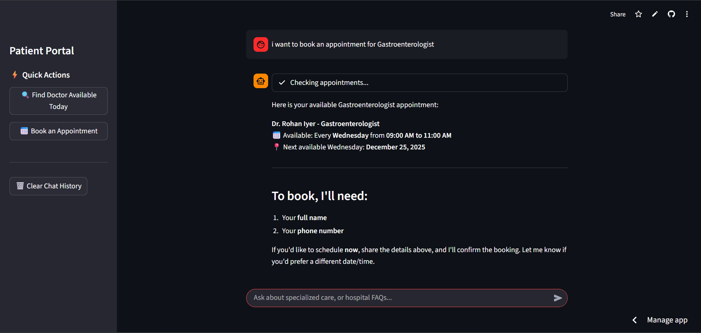
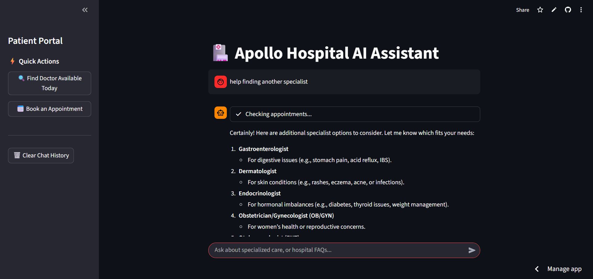
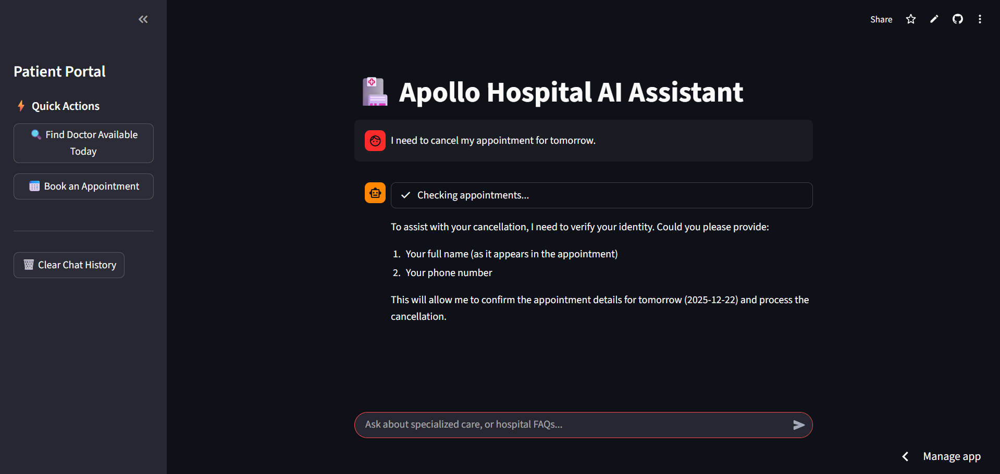

# 🏥 Apollo Hospital AI Assistant

An advanced, multi-modal AI conversational agent designed for **Apollo Hospitals**. This system integrates **Agentic AI** for database management and **Retrieval-Augmented Generation (RAG)** for high-accuracy FAQ handling, all orchestrated by an intelligent semantic router.

**Try the App - Click Below!**

[](https://apollo-hospital-chatbot.streamlit.app/)

## 🚀 System Architecture

The assistant employs a "Router-Worker" architecture to ensure user queries are handled by the most specialized component:

1. **Semantic Router:** Analyzes user intent (e.g., booking vs. general info) using high-speed vector embeddings.
2. **Agentic SQL Worker:** An autonomous agent powered by the **Agno** framework that writes and executes SQL queries to manage doctor schedules and patient bookings.
3. **FAQ RAG Worker:** A semantic search engine using **ChromaDB** to retrieve precise answers from hospital policy documents.

---
[](https://github.com/cryptoguy24/yash-apollo-hospital-chatbot/tree/main/src/architecture.html)

---

## ✨ Key Features

### 📅 Smart Appointment Management (Agentic AI)

* **Symptom-to-Specialist Mapping:** Automatically maps layman terms (e.g., "heart pain") to the correct medical specialty (e.g., "Cardiologist").
* **Two-Step Availability Check:** Verifies both the doctor's general weekly schedule and specific existing bookings to prevent double-booking.
* **CRUD Operations:** Seamlessly books, cancels, and modifies appointments directly in the SQLite database.

### 📖 Knowledge Base (RAG)

* **Context-Aware FAQ:** Uses **LangChain** and **ChromaDB** to answer questions about hospital services, visiting hours, and admission requirements.
* **Historical Context:** Maintains short-term memory to handle follow-up questions accurately.

### 💻 User Experience

* **Streamlit Interface:** A clean, professional chat UI with "Quick Action" buttons for common tasks.
* **Streaming Responses:** Real-time typewriter effect for a more natural conversational feel.

---

## 📸 Project Showcase

### 1. Intelligent FAQ Retrieval (RAG)

When a user asks general questions about hospital services, the system uses Semantic Routing to trigger the RAG pipeline.


### 2. Symptom-to-Specialist Mapping

Patients don't always know which doctor they need. Our agent performs "layman-to-medical" mapping (e.g., "Back hurting" ➔ Orthopedic Surgeon).


### 3. Agentic Appointment Booking

The booking flow is handled by an autonomous agent that manages state and requests missing information.



### 4. Appointment Management & Security

The system handles the full lifecycle of a patient visit, including identity verification for cancellations.




---

## 🛠️ Tech Stack

* **Orchestration:** [Agno](https://agno.com/) (Agentic AI Framework), LangChain.
* **Intelligence:** Groq (Llama 3 / Mixtral models).
* **Routing:** [Semantic Router](https://github.com/aurelio-labs/semantic-router) with HuggingFace Encoders.
* **Databases:** * **Vector:** ChromaDB (FAQ storage).
* **Relational:** SQLite (Appointment system).


* **Frontend:** Streamlit.

---

## ⚙️ Installation

1. **Clone the Repository:**
```bash
git clone https://github.com/cryptoguy24/yash-apollo-hospital-chatbot.git
cd yash-apollo-hospital-chatbot

```


2. **Install Dependencies:**
```bash
pip install streamlit agno semantic-router langchain-groq chromadb pandas python-dotenv

```


3. **Configure Environment:**
Create a `.env` file and add your Groq API Key:
```env
GROQ_API_KEY=your_api_key_here
GROQ_MODEL=llama3-8b-8192
GROQ_MODEL_Q=llama-3.3-70b-versatile

```


4. **Run the App:**
```bash
streamlit run main.py

```


---

## 🛡️ Operational Protocols

The **Agentic Worker** follows strict medical receptionist protocols:

* **Identity Verification:** Always requests patient name and phone number before modifying the database.
* **Soft Deletion:** Appointments are updated to `CANCELLED` status rather than being deleted, preserving medical records.
* **Safety Fallbacks:** Politely declines non-hospital related queries to maintain professional boundaries.

---

**Developed by Yash** | [GitHub](https://github.com/cryptoguy24) | [LinkedIn](https://www.linkedin.com/in/yash-dhanwate/)
